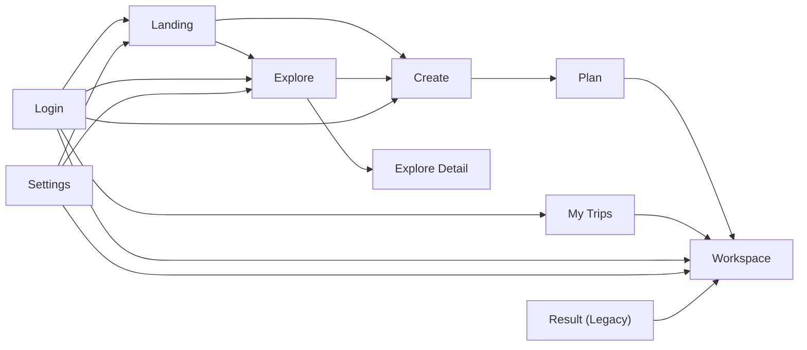

# V1.8 Navigation And State

> 文档状态：v1.8 Step 3A 导航、用户状态与数据流修订
> 本文只定义 Wanderly v1.8 的核心产品区域、辅助流程、用户状态、导航规则与状态归属，不修改任何业务代码。
> 当前代码与文档核对基线：`main` 分支，检查时间 2026-07-11。

## 1. 文档用途与边界

本阶段回答四个问题：

1. Wanderly v1.8 的核心产品区域应该如何定义。
2. 当前已有路由与未来目标路由如何分层。
3. 用户从 Landing、Explore、Create、My Trips 到 Workspace 的链路如何统一。
4. 账户状态、体验设置、长期偏好与单次 Trip 输入分别放在哪里。

本文仍然是设计文档，不创建新路由，不重写现有页面，不调整 Supabase、localStorage 或业务接口。

## 2. 当前路由实况

| 路由 | 当前状态 | 当前实现备注 |
| --- | --- | --- |
| `/` | 已存在 | `app/page.tsx` 渲染 `LandingPage`，当前是三入口落地页，CTA 指向 `/explore`、`/create`、`/workspace`。 |
| `/welcome` | v1.8目标，当前不存在 | 代码中没有该路由。 |
| `/explore` | 已存在 | `app/explore/page.tsx` 渲染 Explore 首页，支持城市搜索、灵感选择、跳转详情和进入 Create。 |
| `/explore/[id]` | 已存在 | `app/explore/[id]/page.tsx` 渲染独立档案详情页。 |
| `/create` | 已存在 | `app/create/page.tsx` 支持普通创建入口和 Explore 带入草稿入口。 |
| `/plan` | 已存在 | `app/plan/page.tsx` 负责补齐字段、确认需求、触发生成。 |
| `/result` | 已存在 | `app/result/page.tsx` 与 `/workspace` 共用 `WorkspaceRoutePage`。 |
| `/workspace` | 已存在 | `app/workspace/page.tsx` 与 `/result` 共用 `WorkspaceRoutePage`。 |
| `/trips` | 已存在 | 已登录用户可查看已保存行程列表；打开历史行程后当前跳转到 `/result`。 |
| `/login` | 已存在 | `app/login/page.tsx` 支持 `returnTo`。 |
| `/favorites` | 已存在 | 收藏档案页已存在。 |
| `/settings` | v1.8目标，当前不存在 | 代码中没有该路由。 |

结论：`/welcome` 与 `/settings` 已经进入 v1.8 目标范围，但当前代码仍不存在；`/result` 与 `/workspace` 当前语义重叠；`/trips -> /workspace` 目标链路当前尚未成立。

## 3. 四个核心产品区域

v1.8 需要围绕以下四个核心产品区域持续精修：

1. Landing：首次品牌欢迎。
2. Explore：日常首页、内容发现与创建分流。
3. Workspace：个人旅行的阅读与编辑。
4. Settings：账户、基础体验和后续长期偏好管理。

说明：

- 这里的“四个核心区域”是产品长期需要持续打磨的主区域。
- Create 很重要，但它属于创建流程入口，不属于四个核心精修区域之一。
- Settings 不再被视为“以后再补的附属页”，而是 v1.8 结构里明确保留的核心区域。

## 4. 辅助流程和页面

以下页面与流程很重要，但不属于“四个核心产品区域”的定义：

- Create：旅行创建流程的起点。
- Plan：Create 内部的需求补全过程。
- My Trips：用户已有旅行计划的管理列表。
- Login：身份验证流程。
- Explore Detail：Explore 内部的档案阅读体验。
- Result：旧版兼容入口。

产品层级上应明确：

- Landing / Explore / Workspace / Settings 是主区域。
- Create / Plan / My Trips / Login / Explore Detail / Result 是支撑这些主区域的流程页或兼容页。

## 5. 当前实现基础

### 5.1 Landing

- `/` 当前不是状态感知型首页，而是三个入口按钮。
- 当前 CTA 为 `探索灵感`、`创建计划`、`我的旅行`。
- 代码里还没有“首次用户”和“回访用户”分流。

### 5.2 Explore

- `/explore` 当前已支持城市搜索。
- 搜索结果不是列表页内切换，而是匹配后直接 `router.push("/explore/[slug]")`。
- 灵感卡可以先组成 `TripPlanDraft`，再进入 Create。
- 档案详情页已存在。
- `ArchiveDrawerShell`、`ArchiveViewer mode="drawer"` 组件已存在，但尚未形成完整的 Explore 首页抽屉交互闭环。

### 5.3 Create / Plan / Workspace

- Explore 进入 Create 时，当前会先 `markCurrentTripAsUnsaved()`，再把 `TripPlanDraft` 写入本地存储，然后跳转 `/create?entry=explore`。
- `/create` 当前主要负责“选择如何开始”，真正补信息在 `/plan`。
- `/plan` 生成成功后当前跳转 `/workspace`。
- `/result` 与 `/workspace` 当前都读取同一份 localStorage 数据，并共用同一个 `WorkspaceRoutePage`。
- Workspace 内部已经存在 `Read Mode` / `Edit Mode` 切换。

### 5.4 My Trips / Login / Favorites

- `/trips` 已接入登录态校验与 Supabase 用户会话。
- 从“我的行程”打开历史行程时，当前恢复到本地存储后跳转 `/result`，不是 `/workspace`。
- `/login` 当前通过 `returnTo` 回跳，且仅允许以 `/` 开头的站内路径。
- `/favorites` 当前是已存在的档案收藏页，但还没有纳入首页主导航决策。

## 6. 全站页面关系

### 6.1 产品区域与辅助页面关系

### 6.2 路由角色分类

| 分类 | 路由 |
| --- | --- |
| 核心区域路由 | `/`、`/explore`、`/workspace`、`/settings`（v1.8目标，当前不存在）、`/welcome`（v1.8目标，当前不存在） |
| 创建流程路由 | `/create`、`/plan` |
| 内容阅读路由 | `/explore/[id]`、`/favorites` |
| 账户与列表路由 | `/login`、`/trips` |
| 兼容路由 | `/result` |

说明：

- `/welcome` 是 Landing 的独立访问地址，不是 Explore 的别名。
- `/settings` 是核心区域，但当前代码尚未实现。
- `/result` 是兼容路由，不再定义为独立工作台。

## 7. Landing 与 `/welcome` 规则

### 7.1 `/welcome` 定位

- `/welcome` 是规划中的独立 Landing 访问地址。
- 当前代码尚未实现时，必须标记为“v1.8目标，当前不存在”。
- `/welcome` 用于用户主动重新查看品牌欢迎页、产品分流与轻引导。

### 7.2 `/` 与 `/welcome` 的目标规则

| 场景 | 目标行为 |
| --- | --- |
| 新用户访问 `/`，且首次引导未完成 | 根据首次引导状态展示 Landing，可进入 `/welcome` 所承载的欢迎体验。 |
| 已完成首次引导的用户访问 `/` | 进入 `/explore`。 |
| 已登录用户访问 `/` | 默认进入 `/explore`，不再强制先看 Landing。 |
| 任意用户主动访问 `/welcome` | 允许直接访问，不做强制拦截。 |
| 已登录用户访问 `/welcome` | 允许停留在欢迎页，同时可看到“进入Explore”或“返回我的旅行”的轻入口。 |
| 深层链接访问 `/create`、`/plan`、`/workspace`、`/trips`、`/explore/[id]` | 不经过 `/welcome` 强制拦截。 |

### 7.3 `/welcome` 的行为边界

- 打开 `/welcome` 不会重置首次引导状态。
- `/welcome` 不应强制用户退出登录。
- `/welcome` 是主动访问入口，不是全站强制前置拦截器。
- 首次引导状态用于决定 `/` 的进入行为，不用于阻断深层页面访问。

### 7.4 当前状态与目标差异

- 当前代码里 `/welcome` 不存在。
- 当前首页 `/` 仍是固定三入口页，没有首次引导判断。
- v1.8 目标是把 `/` 变成状态感知入口，把 `/welcome` 变成可主动访问的独立 Landing 地址。

## 8. Explore 目标规则

### 8.1 Explore 首页

Explore 需要同时支持三种进入方式：

1. 搜索城市档案。
2. 浏览灵感内容。
3. 直接触发“AI 帮我从这里开始创建”。

目标行为：

- 搜索应优先命中已有档案。
- 无命中时，可以提示直接转 Create，而不是让用户停在空结果。
- 灵感选择不应直接等同于“已完成创建”，只能生成一个可继续编辑的草稿。
- “AI 直接创建”本质上仍进入 Create，不应绕过个人约束确认。

### 8.2 档案架与档案抽屉

目标上 Explore 应区分：

- 档案架 shelf：Explore 首页上的卡片流。
- 档案抽屉 drawer：同页打开的详情阅读层。
- 档案独立页 page：可分享、可直达的 `/explore/[id]`。

目标交互规则：

| 行为 | 目标规则 |
| --- | --- |
| 打开档案 | 桌面端优先开 drawer，移动端可直接进 page。 |
| 折叠 drawer | 保留 Explore 当前滚动位置与筛选状态。 |
| 关闭 drawer | 回到 shelf，不清空用户当前筛选。 |
| Restore | 若用户刚从 drawer 关闭，再次打开应恢复上一条档案。 |
| Switch article | 在 drawer 已打开时切换别的档案，应更新 drawer 内容，不强制先关闭。 |

当前差距：抽屉组件已存在，但当前主流程仍主要是 `/explore/[id]` 独立页跳转。

### 8.3 “用此行程创建”数据流

目标数据流必须明确分四层：

1. `archive source data`
2. `template draft`
3. `trip draft`
4. `personal trip`

定义如下：

| 层级 | 含义 | 是否可直接展示给用户 |
| --- | --- | --- |
| archive source data | Explore 公共档案原始内容 | 可以阅读，不应被误认为用户自己的行程 |
| template draft | 从档案抽出的结构化种子 | 可以作为创建起点，但仍是半成品 |
| trip draft | 用户在 Create/Plan 中补全中的个人草稿 | 可以继续编辑，不应被当作最终成品 |
| personal trip | 生成后的个人行程 | 是 Workspace 的真实对象 |

目标规则：

- 点击“用此行程创建”后，先把档案内容转换成 `template draft`。
- 再以 `template draft` 初始化 `trip draft`。
- 用户在 Create/Plan 补齐个人约束后，生成 `personal trip`。
- `archive source data` 与 `personal trip` 必须保持可追溯，但不能相互覆盖。

当前实现基础：

- `buildTripPlanDraftFromExplore()` 已承担从档案到草稿种子的转换。
- `startExploreCreateFlow()` 已把 `TripPlanDraft` 写入本地并跳去 `/create?entry=explore`。

## 9. Workspace 与 `/result` 兼容入口规则

### 9.1 当前代码状态

- `/workspace` 已存在。
- `/result` 已存在。
- 两者当前共用 `WorkspaceRoutePage`，读取同一份 localStorage 数据。
- 新生成行程当前从 `/plan` 进入 `/workspace`。
- 历史已保存行程当前从 `/trips` 打开后进入 `/result`。

### 9.2 v1.8 迁移目标

- `/workspace` 是 v1.8 后个人旅行计划的正式入口。
- 从 Create / Plan 生成完成后进入 `/workspace`。
- 从 My Trips 打开历史计划进入 `/workspace`。
- 从 Explore 模板创建完成后进入 `/workspace`。
- `/result` 不继续发展成第二套独立工作台。
- `/result` 暂时保留，用于兼容旧链接和旧流程。
- 旧链接访问 `/result` 时，应在确认 Trip 身份和草稿状态后安全转入对应 Workspace。
- 在所有入口迁移完成且经过测试前，不直接删除 `/result`。
- 避免 `/result` 与 `/workspace` 长期维护两套状态和 UI。

### 9.3 立即不做的事

- 不修改实际路由。
- 不把 `/result` 直接删除。
- 不宣称 `/trips -> /workspace` 已经在当前代码完成。
- 不新增第二套 Result 专属数据结构或专属工作台视觉体系。

### 9.4 Workspace 的 Read / Edit 关系

当前基础：

- Workspace 内部已经有 `workspaceMode = "read" | "edit"`。
- 顶部栏已有两种模式切换。

v1.8 目标规则：

- `Workspace Read` 是默认打开态，优先让用户先看清路线与节奏。
- `Workspace Edit` 是同一条个人行程的编辑态，不是新页面、也不是第二份数据。
- Read / Edit 必须共享同一份 `personal trip` 数据源。
- 待修改项、快捷修改、导出、重新生成都属于 Edit 上下文。
- 任何“切模式”都不能把用户导向另一个 trip identity。

结论：Read / Edit 是同一页面对象的两个视角，不是 `/result` 与 `/workspace` 两条平行产品线。

## 10. My Trips 与 Workspace 关系

`/trips` 负责“我有哪些行程”，`/workspace` 负责“我正在阅读或编辑哪一条行程”。

因此目标关系应该是：

- `/trips` 是列表页。
- 选择某条历史行程后，统一进入 `/workspace`。
- `/workspace` 打开的对象必须有“当前 trip identity”，而不是只靠一份匿名 localStorage。

当前差距：

- 当前 `openSavedTripIntoWorkspace()` 实际跳转到 `/result`。
- `/result` 与 `/workspace` 读取的仍是同一份本地状态。
- 这意味着当前“历史已保存行程”和“刚生成未保存行程”在页面层几乎没有身份隔离。

## 11. Settings 最终职责

`/settings` 当前不存在，但在 v1.8 目标中它是核心产品区域之一，不再只承担“以后再说的长期偏好”。

### 11.1 账户

Settings 基础版包括以下账户项：

- 当前登录邮箱。
- 登录状态。
- 退出登录。
- Magic Link 相关状态说明。
- 查看欢迎页。

### 11.2 基础体验

Settings 基础版包括以下体验项：

- 显示偏好。
- 动效偏好。
- 基础地图显示偏好。
- 设置保存、成功、失败和恢复默认值状态。

### 11.3 后续长期旅行偏好

后续逐步加入：

- 常用出发城市。
- 默认预算。
- 默认旅行节奏。
- 常见同行类型。
- 兴趣。
- 饮食偏好。
- 特殊出行要求。

### 11.4 长期默认偏好与单次输入的关系

规则必须明确为：

`Settings 默认偏好 -> Create 自动预填 -> 用户为当前旅行修改 -> 修改只影响当前 Trip`

只有用户明确选择“保存为我的默认偏好”时，才允许将本次输入反向更新 Settings。

明确禁止：

- 自动把单次旅行输入写回长期偏好。
- 用隐式行为追踪替代用户设置。
- 让长期偏好覆盖用户本次明确填写的内容。

### 11.5 Settings 与 Create 的关系

- Settings -> Create 是“预填充关系”。
- Create -> Settings 不是自动回写关系。
- 单次行程输入属于当前 Trip，不属于长期账户设置。
- 账户与体验设置属于 Settings；Trip 约束属于 Create / Plan。

## 12. 登录与回跳规则

### 12.1 当前基础

- `UserMenu` 会根据当前 pathname 生成 `/login?returnTo=...`。
- `/login` 对 `returnTo` 做轻校验，只接受站内绝对路径。
- Supabase 浏览器客户端启用了 `persistSession: true` 与 `detectSessionInUrl: true`。

### 12.2 目标规则

| 登录发起位置 | 登录后目标回跳 |
| --- | --- |
| `/` | 回到 `/` |
| `/welcome` | 若未来存在，则回到 `/welcome` |
| `/explore` | 回到 `/explore` |
| `/explore/[id]` | 回到当前档案 |
| `/create` | 回到 `/create` |
| `/plan` | 回到 `/plan` |
| `/workspace` | 回到 `/workspace` |
| `/trips` | 回到 `/trips` |
| `/favorites` | 回到 `/favorites` |
| `/settings` | 若未来存在，则回到 `/settings` |

补充规则：

- 登录不应清空本地 trip draft。
- 登录只是身份接入，不应改变当前创建阶段。
- 对不存在或非法的回跳路径，一律回 `/`。

## 13. 状态存储建议

### 13.1 存储分层原则

v1.8 采用“三层状态”原则：

1. 会话级轻状态：路由来源、打开的 drawer、onboarding 完成标记。
2. 本地草稿状态：未提交的 trip draft、已生成但未保存的 personal trip。
3. 云端账户状态：已保存 trips、登录会话、未来的 Settings 主记录。

### 13.2 推荐表

| 状态对象 | 推荐存储 | 原因 |
| --- | --- | --- |
| onboarding 是否完成 | `localStorage` | 轻量、跨刷新保留、无需服务端。 |
| Landing 最近入口偏好 | `localStorage` | 个体化体验，不涉及安全。 |
| Explore 当前筛选、滚动、最后打开档案 | URL 参数或 session/local storage 轻状态 | 便于恢复页面上下文。 |
| archive drawer 是否打开 | URL 状态优先，必要时配合内存态 | 便于分享与恢复。 |
| template draft | `localStorage` | 从 Explore 进入 Create 时需要跨页保留。 |
| trip draft | `localStorage` | 用户尚未提交前必须可恢复。 |
| generated personal trip（未保存） | `localStorage` | 支撑 `/workspace` 刷新恢复。 |
| saved trip identity | `localStorage` + 云端主记录 | 本地负责“当前打开的是哪条”，云端负责真实数据。 |
| saved trips 列表 | 云端 | 属于账号资产。 |
| auth session | Supabase 持久会话 | 已有实现。 |
| Settings 账户与体验设置 | 云端优先，必要时可缓存本地 | 适合跨设备复用与登录态绑定。 |
| 长期旅行默认偏好 | 云端优先 | 本质上属于账户级设置。 |

### 13.3 当前已存在的本地键

当前代码中已经存在的关键 localStorage 键：

- `travel-planning:parsed-trip`
- `travel-planning:trip-draft`
- `travel-planning:trip-plan-draft`
- `travel-planning:trip-request`
- `travel-planning:trip-plan`
- `travel-planning:trip-enrichment`
- `travel-planning:trip-weather-summary`
- `travel-planning:restored-saved-trip`

结论：现有本地存储已经足以支撑 Step 3A 的设计，但还缺少更清晰的“路由上下文状态”“首次引导状态”和“Settings 账户/体验设置”归属。

## 14. 当前与目标差距表

| 主题 | 当前代码 | v1.8 目标 |
| --- | --- | --- |
| 核心区域定义 | Landing / Explore / Create / Workspace 的叙事更强 | Landing / Explore / Workspace / Settings 作为四个核心区域 |
| `/welcome` | 不存在 | v1.8目标，当前不存在；作为可主动访问的 Landing 地址 |
| `/settings` | 不存在 | v1.8目标，当前不存在；作为账户、体验和长期偏好区域 |
| `/` 首页行为 | 固定三入口页 | 根据首次引导和登录状态分流到 Landing 或 Explore |
| Explore 详情打开方式 | 主要是独立页跳转 | 桌面端优先 drawer，页内切换 |
| Explore 搜索无结果处理 | 当前偏直接匹配跳转 | 无结果时引导去 Create |
| 用档案创建 | 已能写入 `TripPlanDraft` | 明确区分 archive -> template draft -> trip draft -> personal trip |
| 生成后正式入口 | `/workspace` | 保持 `/workspace` |
| 历史 trip 打开 | 跳 `/result` | 统一跳 `/workspace` |
| `/result` 语义 | 与 `/workspace` 重叠 | 退为兼容入口，不继续扩展成第二套工作台 |
| Workspace 数据身份 | 主要依赖本地匿名状态 | 强化“当前 trip identity”概念 |
| Settings 作用 | 目前尚未实现 | 账户、体验设置、长期偏好并存，但不自动吸收单次 Trip 输入 |

## 15. 异常与恢复场景

### 15.1 草稿恢复

- 如果用户在 `/create`、`/plan` 刷新，应该恢复 `trip draft`。
- 如果用户在 `/workspace` 刷新，应该恢复最近一次 `personal trip`。
- 如果本地草稿损坏，页面应退回上游入口，而不是展示半渲染状态。

### 15.2 登录相关

- 用户登录前已在编辑行程，登录后应回原页并继续编辑。
- 登录失败不应清空 Create / Workspace 本地状态。
- 已登录用户访问 `/welcome` 时，不应被要求先退出登录。

### 15.3 Explore 相关

- drawer 内容加载失败时，用户仍应能关闭并返回 shelf。
- 城市搜索无匹配时，应提供“直接创建我的版本”的恢复路径。

### 15.4 Trips 与 Result 迁移相关

- 历史行程恢复到本地失败时，不应污染当前未保存 trip。
- 删除云端 trip 成功后，应立即从列表移除，但不应影响当前打开中的本地草稿。
- 旧链接通过 `/result` 进入时，若无法确认 trip identity，应进入安全兜底而不是错误打开另一条 trip。

## 16. 安全与隐私边界

### 16.1 必须明确区分的三类数据

1. 公共 Explore 档案。
2. 用户本地草稿。
3. 用户账户下的云端已保存行程与未来 Settings 数据。

### 16.2 边界规则

- 公共档案不应被误显示为“我的行程”。
- 本地草稿在未保存前，不应默认上传到云端。
- 登录只接入账户，不自动把所有本地草稿变成云端资产。
- `returnTo` 必须继续限制为站内路径，避免开放重定向。
- Settings 的长期默认偏好不应隐式吸收单次 Trip 输入。
- 单次 Trip 中用户明确填写的内容优先级高于长期默认偏好。

## 17. 后续各页面必须遵守的规则

1. 一级产品区域围绕 Landing / Explore / Workspace / Settings 组织，不再把 Create 误写成第四核心区域。
2. `/welcome` 是独立 Landing 地址，但当前仍是“v1.8目标，当前不存在”。
3. `/plan` 属于 Create 内部步骤，不升格为一级产品区域。
4. 任何“从灵感到个人行程”的入口都必须落到同一条 Create -> Plan -> Workspace 链路。
5. `/workspace` 是个人旅行计划的正式入口。
6. `/result` 只保留兼容语义，不再新增独立产品能力。
7. Read / Edit 共享同一条 personal trip，不复制第二份页面对象。
8. 登录、保存、恢复都不能破坏当前 trip identity。
9. Settings 负责账户、基础体验和长期默认偏好，但不自动回收单次 Trip 输入。

## 18. Step 3A 决策摘要

Step 3A 的核心结论如下：

1. v1.8 的四个核心产品区域是 Landing、Explore、Workspace、Settings。
2. Create、Plan、My Trips、Login、Explore Detail、Result 都是重要辅助流程或兼容页面，不属于“四个核心区域”的最终定义。
3. `/welcome` 作为独立 Landing 访问地址被保留，但当前仍不存在，属于 v1.8 目标。
4. `/workspace` 是正式个人旅行入口；`/result` 退为兼容入口，不立即删除。
5. `/trips -> /workspace` 是迁移目标，当前代码尚未完成，现状仍是 `/trips -> /result`。
6. Settings 不只承载长期旅行偏好，还包括账户与基础体验设置。
7. 单次 Trip 输入不会自动写回 Settings，只有用户明确选择“保存为我的默认偏好”时才允许更新长期默认值。
